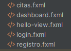
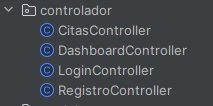
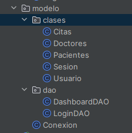
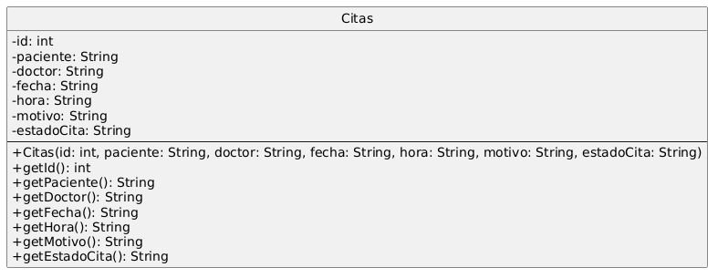
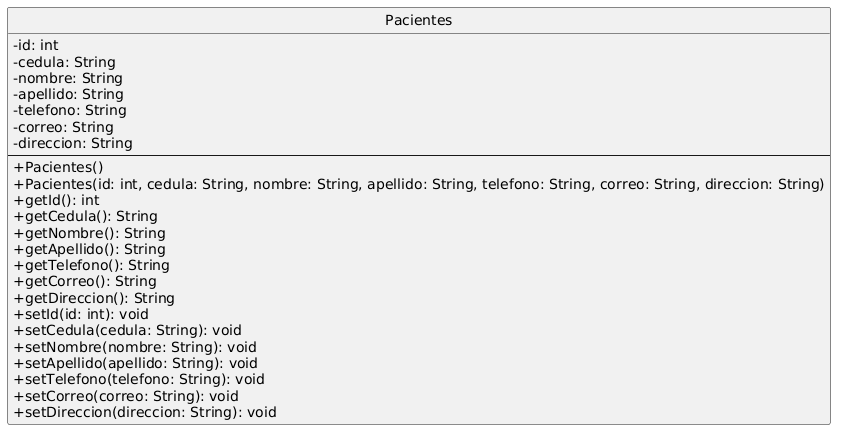
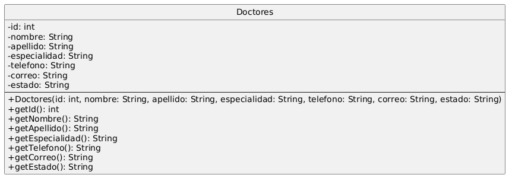
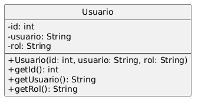

# CitaMed
CitaMed es un aplicacion de escritorio interactiva e intuitiva que te permite adminitrar tu clinica.
---

## Características
- **Administra citas**: Registra, edita, elimina, crea y valida horarios.
- **Gestiona Doctores y Pacientes**: Registra, edita, elimina y crea.
- **Ingresa sesion**: 

---

## Arquitectura: MVC
- **Vista**:

- **Controlador**:

- **Modelo**:

---
## Clases principales
- **Cita**

- **Paciente**

- **Doctor**

- **Usuario**

---

## Requisitos
- **Java Development Kit (JDK)**: 17 o superior.
- **MySQL Server**: 8.0 o superior. Tambien puede usarse el servicio de MySQL de xammp.
- **IDE de preferencia**: Compatible con Java

---

## Interfaz Grafica
- **Login**

- **Registro**

- **Dashboard**

- **Citas**

---

## Tecnologias
|Componente|Tecnologia|Proposito|
|----------|----------|---------|
|Lenguaje de programación|Java 17|Desarrollo de la lógica de la aplicación.|
|Gestor de proyectos|Apache Maven|Administración de dependencias, compilación y empaquetado del proyecto.|
|Interfaz gráfica|JavaFX 21.0.6|Desarrollo de la interfaz de usuario.|
|Diseño de interfaces|JavaFX FXML|Separación del diseño gráfico de la lógica de la aplicación.|
|Base de datos|MySQL|Almacenamiento de la información del sistema.|
|Conector de base de datos|MySQL Connector/J 9.4.0|Comunicación entre la aplicación Java y MySQL mediante JDBC.|
|Compilador|Maven Compiler Plugin 3.13.0|Compilación del proyecto utilizando Java 17.|
|Ejecución JavaFX|JavaFX Maven Plugin 0.0.8|Ejecución y generación de la aplicación JavaFX desde Maven.|

---

## Licencia
Proyecto académico — EPN (Escuela Politécnica Nacional)
